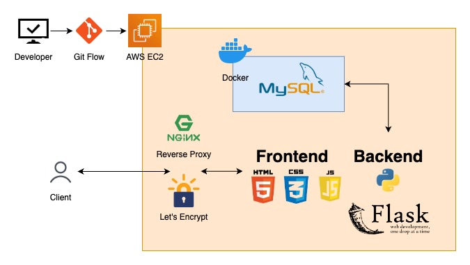

# [台北一日遊](https://taipei-day-trip.minglin.vip/)

### 台北一日遊是一個電商網站，可以讓您搜尋、預定景點

1. 透過景點名稱、捷運站名稱或關鍵字，搜尋附近景點。
2. 透過搜尋功能，取得景點詳細資訊以及預訂行程。
3. 透過 **TapPay 金流服務**，完成付款，取得訂單編號。
4. 延遲載入功能
5. 滾動式呈現景點資訊
6. 景點畫面輪播圖

測試用：

- 帳號：test@gmail.com
- 密碼：123456
- 手機號碼：0912345678
- 卡片號碼：4242 4242 4242 4242
- 過期時間：12/24 （有效期間內即可）
- 驗證密碼：123

## 系統架構

1. 透過 **Git Flow** 的方式開發，確保各個版本的控制
2. 主程式是採用前、後端分離的方式去開發，前端使用 **HTML**、**CSS**、**JavaScript**，後端使用 **Python Flask** ，並採用 **MVC** 架構去設計
3. 資料庫使用 **MySQL** ，儲存會員資料、景點資料、預定資料、訂單資料
4. 當用戶連線到伺服器時，會透過 **Nginx** 反向代理，自動將連線升級為 **HTTPS**，確保所有資料傳輸的安全性。

## 資料庫架構

- member、token 儲存會員資相關料
- attractions、images 儲存景點相關資訊
- booking 預定資料
- orders 訂單資料
